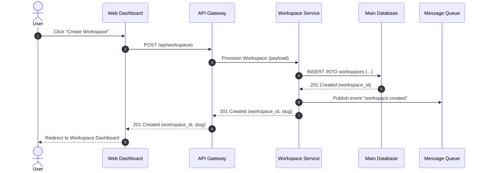
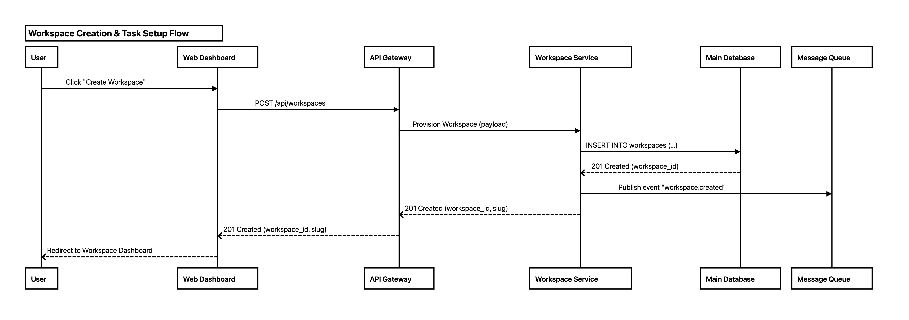
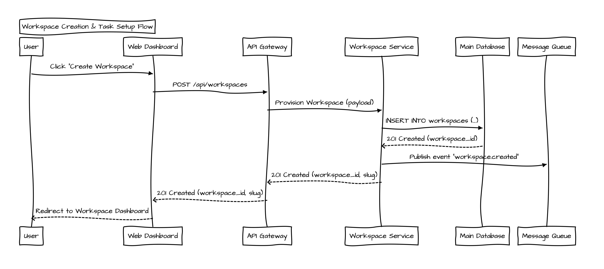

<div align="center">

# 📊 Sequify

**Offline Sequence Diagram & Vector PDF Generator for AI Coding Agents**

[](LICENSE)
[](https://apple.com)
[](https://skills.sh)
[](#-key-features)
[](#-how-it-works)

<p align="center">
  Transform code flows into <b>interactive visual diagrams</b>, <b>structured API specification tables</b>, and <b>printable vector PDF artifacts</b> — generated 100% offline in under 2 seconds.
</p>

[Installation](#-installation) • [Output Specs](#-output-specifications) • [Usage](#-usage-in-antigravity) • [Architecture](#-repository-architecture) • [License](#-license)

</div>

---

## 💡 Overview

When designing system architectures with AI coding assistants, standard text code blocks are difficult to share and review. 

**Sequify** bridges this gap: with a single action (`/sequify`, `/sequence`, or `/diagram`), the AI analyzes your codebase, isolates microservices into dedicated participant headers, and automatically compiles the flow into **visual previews**, **API data contracts**, and **downloadable vector PDFs**.

```
┌─────────────────┐       ┌─────────────────┐       ┌───────────────────────────────┐
│   User Prompt   │ ───►  │ AI Code Analysis│ ───►  │        Sequify Engine         │
│  "/sequify..."  │       │  & Grammar Gen  │       │  (Headless Native WebKit CLI) │
└─────────────────┘       └─────────────────┘       └──────────────┬────────────────┘
                                                                   │
                                      ┌────────────────────────────┴────────────────────────────┐
                                      ▼                                                         ▼
                       ┌─────────────────────────────┐                           ┌─────────────────────────────┐
                       │      Agent Chat Output      │                           │      Generated Artifacts    │
                       ├─────────────────────────────┤                           ├─────────────────────────────┤
                       │ • Native Visual Diagram     │                           │ • 📄 <flow>.pdf (Vector)   │
                       │ • Structured API Table      │                           │ • 🖼️ <flow>.png (High-DPI) │
                       │ • Concise Flow Summary      │                           │ • 📝 <flow>.seq (Grammar)   │
                       │ • Direct Artifact Links     │                           │ • 📑 <flow>.md  (Document)  │
                       └─────────────────────────────┘                           └─────────────────────────────┘
```

---

## 🎯 Output Specifications

Sequify follows a clean, predictable two-tier output format:

### 1. In-Chat Agent Response
* **Visual Diagram**: Rendered directly in chat via native agent diagram syntax (e.g. Mermaid sequence block) or high-DPI image preview.
* **API Specifications Matrix**: Comprehensive table mapping Step Order, HTTP Method, Endpoint Path, Custom Headers, Request Payload / Query Params, and Response Data Models.
* **Flow Explanation**: Clear architectural walkthrough highlighting concurrency, lifecycles, and database interactions.
* **Direct File Links**: Clickable links to open the generated PDF, image, and sequence files.

### 2. Export Artifacts & Files
Strictly generates only **3 core files** per diagram:

| File Extension | Format | Description |
| :--- | :--- | :--- |
| **`.pdf`** | Vector PDF Document | High-resolution, printable PDF document formatted for architectural reviews and PR attachments. |
| **`.png`** | High-DPI Raster Image | Crisp image preview embedded directly in IDE Markdown artifacts. |
| **`.seq`** | Plaintext Grammar | Raw [js-sequence-diagrams](https://bramp.github.io/js-sequence-diagrams/) source code for manual editing. |

---

## ✨ Key Features

- **⚡ 100% Offline & Self-Contained**: Bundles all JavaScript engines (`Snap.svg`, `Underscore`, `js-sequence-diagrams`) and fonts. No internet access or node modules required at runtime.
- **🚀 Native macOS WebKit Engine**: Swift-powered headless rendering compiles complex multi-actor flows to vector PDF and PNG in sub-seconds.
- **🎨 Two Visual Themes**:
  - `simple`: Modern, clean vector lines and crisp sans-serif typography.
  - `hand`: Expressive hand-drawn sketch style with embedded Architects Daughter font.
- **🔒 Dedicated API Separation**: Automatically isolates backend microservices into dedicated participant headers instead of generic backend blocks.

---

## 🚀 Installation

### Option 1: Via `npx skills` (Recommended)

Install using the open agent ecosystem tool ([skills.sh](https://skills.sh)):

```bash
# Global installation (Available across all workspaces and agents)
npx skills add ajinumoto/Sequify -g

# Or install for the current workspace only
npx skills add ajinumoto/Sequify
```

---

### Option 2: 1-Line Terminal Installer

```bash
curl -fsSL https://raw.githubusercontent.com/ajinumoto/Sequify/main/install.sh | bash
```

---

### Option 3: Team Workspace Git Sharing

To share Sequify automatically with your team in a shared repository:

```bash
cd /path/to/your/project

# Install into workspace .agents directory
curl -fsSL https://raw.githubusercontent.com/ajinumoto/Sequify/main/install.sh | bash -s -- --workspace .

# Commit to Git
git add .agents/skills/sequify
git commit -m "feat: add Sequify sequence diagram skill"
git push
```

> **Note**: Any team member who clones the repository will automatically have the `/sequify`, `/sequence`, and `/diagram` actions available without extra configuration.

---

## 🛠️ Usage in Antigravity

Trigger Sequify by typing `/sequify`, `/sequence`, `/diagram`, or asking naturally:

```text
/sequify
```
> *"Sequify the workspace creation and initial task setup flow"*  
> *"Create a sequence diagram for user authentication and permission checks with API specifications"*

### Example Agent Response:

```markdown
### Workspace Creation & Task Setup Flow



#### API Specifications Table

| Step | HTTP Method | Endpoint Path | Standard Headers | Request Payload | Response Model |
| :--- | :--- | :--- | :--- | :--- | :--- |
| **1** | `POST` | `/api/workspaces` | `Authorization: Bearer <TOKEN_REDACTED>`, `Content-Type: application/json` | `{"name": "Engineering Hub", "plan": "team"}` | `WorkspaceCreatedResponse` |
| **2** | `GET` | `/api/workspaces/{id}/members` | `Authorization: Bearer <TOKEN_REDACTED>` | None (Path Parameter: `id`) | `MemberListResponse` |
| **3** | `POST` | `/api/tasks` | `Authorization: Bearer <TOKEN_REDACTED>`, `X-Request-ID: req_771a` | `{"title": "Initial Setup", "assignee_id": "usr_99"}` | `TaskCreatedResponse` |
| **4** | `POST` | `/api/webhooks/dispatch` | `X-Service-Token: <TOKEN_REDACTED>`, `Content-Type: application/json` | `{"event": "task.created", "task_id": "tsk_01"}` | `WebhookAckResponse` |

#### Generated Visual Artifacts

<p align="center">
  <b>Modern Theme (Default: <code>--theme simple</code>)</b>
  <br>
  
</p>

<p align="center">
  <b>Hand-Drawn Sketch Theme (<code>--theme hand</code>)</b>
  <br>
  
</p>

> [!TIP]
> **Download Sample Artifacts**:
> - 📄 [Download Vector PDF Sample (`workspace_flow.pdf`)](docs/assets/workspace_flow.pdf)
> - 🖼️ [Download High-DPI PNG Sample (`workspace_flow.png`)](docs/assets/workspace_flow.png)
> - 📝 [View Sequence Grammar (`workspace_flow.seq`)](docs/assets/workspace_flow.seq)
```

---

## 🔒 Security & Privacy

Sequify is built from the ground up adhering to enterprise AI skill security best practices:
- **⚡ 100% Local & Offline**: All rendering is executed locally via macOS WebKit without any outbound network calls or cloud telemetry.
- **🛡️ Cryptographic Subresource Integrity (SRI)**: All bundled offline vendor scripts (`Snap.svg`, `Underscore`, `js-sequence-diagrams`) and fonts are verified against hardcoded SHA-256 cryptographic checksums before DOM injection.
- **📦 Zero-Binary Source Distribution**: Repositories ship strictly as clean, transparent Swift source code (`render_diagram.swift`), eliminating untrusted precompiled binary risks.
- **🔒 Sandboxed & Escaped**: Diagram inputs are size-bounded (max 512 KB) and serialized via strict JSON boundaries to prevent script breakout, HTML injection, or command tampering.
- **🔑 Privacy-Preserving API Documentation**: Skill rules strictly mandate the redaction of real authorization tokens, bearer credentials, and cryptographic signatures.

---

## 🏗️ Repository Architecture

```text
sequify/
├── install.sh                  # One-click installer (Global / Workspace)
├── uninstall.sh                # Clean uninstaller script
├── LICENSE                     # MIT License & 3rd-party notices
├── README.md                   # Project documentation
└── sequify/                    # Antigravity skill package
    ├── SKILL.md                # Skill prompt & agent execution workflow
    ├── resources/
    │   ├── template.html       # Standalone HTML viewer template
    │   └── vendor/             # Bundled offline JS & Font (~160 KB total)
    │       ├── ArchitectsDaughter-Regular.ttf
    │       ├── snap.svg-min.js
    │       ├── underscore-min.js
    │       ├── sequence-diagram-snap-min.js
    │       └── svginnerhtml.min.js
    └── scripts/
        ├── render_diagram.swift # Swift WebKit headless renderer (with SHA-256 SRI)
        └── compile.sh           # Local compilation helper
```

---

## 🗑️ Uninstallation

```bash
# If installed via npx skills:
npx skills remove sequify -g

# If installed via install.sh:
./uninstall.sh
```

---

## 📄 License

This project is licensed under the [MIT License](LICENSE).

### Third-Party Acknowledgements
- [js-sequence-diagrams](https://bramp.github.io/js-sequence-diagrams/) by Andrew Brampton (Simplified BSD License)
- [Snap.svg](https://snapsvg.io/) by Adobe Systems Inc. (Apache 2.0)
- [Underscore.js](https://underscorejs.org/) (MIT License)
- [Architects Daughter Font](https://fonts.google.com/specimen/Architects+Daughter) by Kimberly Geswein (SIL Open Font License 1.1)
