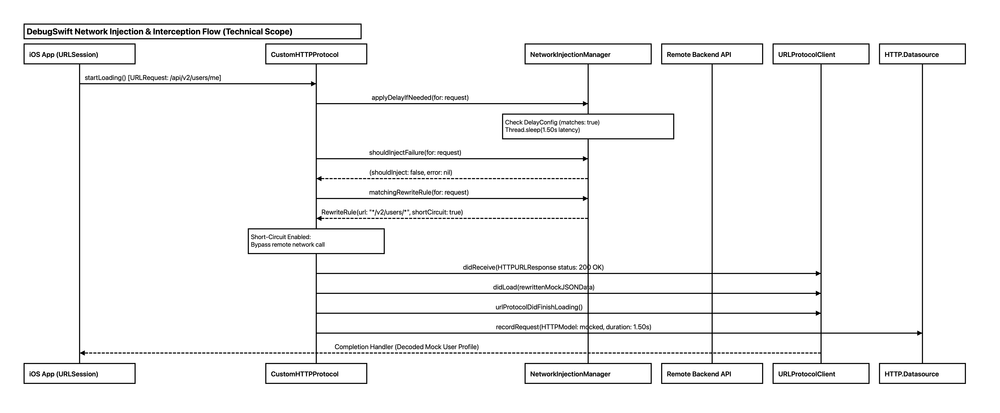
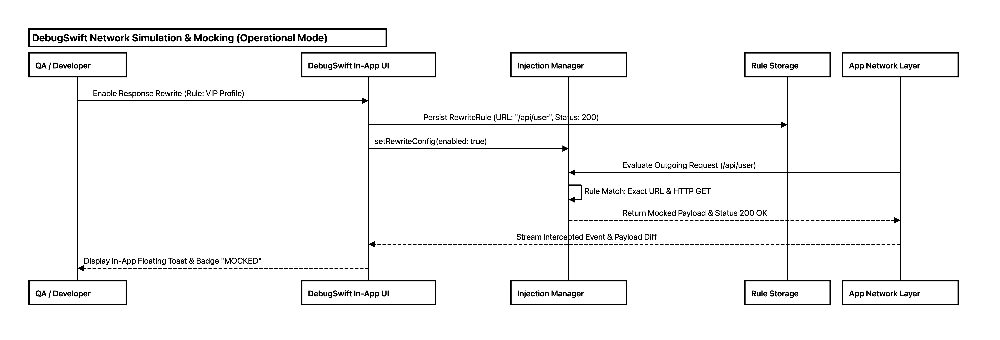
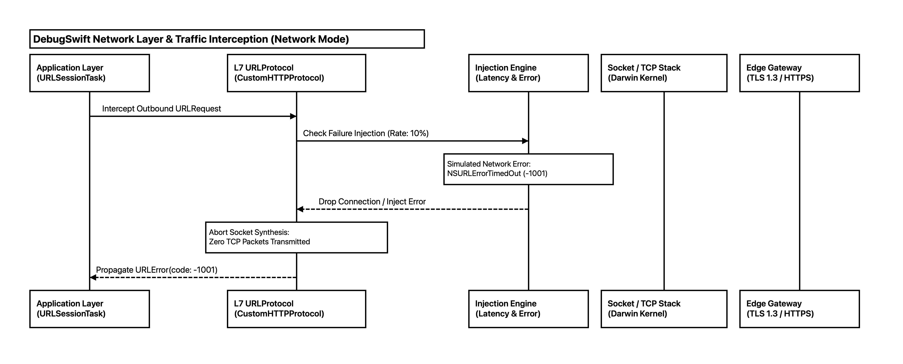
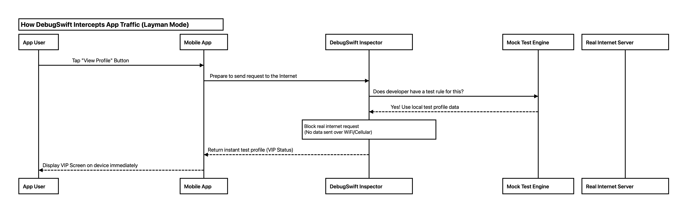
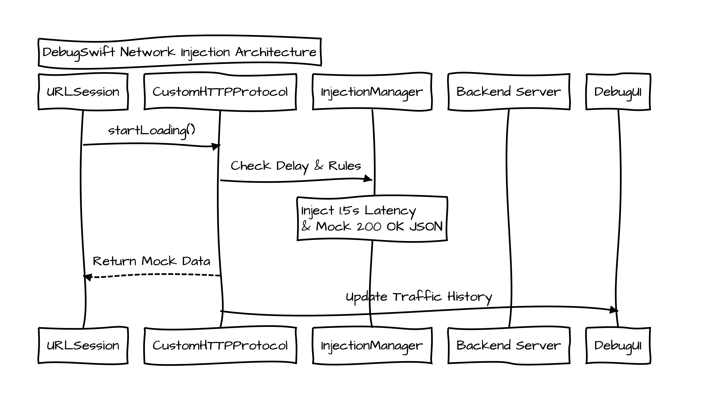

<div align="center">

# 📊 Sequify

**Offline Sequence Diagram & Vector PDF Generator for AI Coding Agents**

[](LICENSE)
[](https://apple.com)
[](https://skills.sh)
[](#-security--privacy)
[](#-key-highlights)

<p align="center">
  <b>🔍 Code-to-Diagram</b> • <b>🎯 Audience-Tailored Modes</b> • <b>📐 Flexible Formats</b> • <b>📦 Ready-to-Use Output Artifacts</b>
</p>

[Key Highlights](#-key-highlights) • [Code to Diagram](#-1-code-to-diagram-zero-hallucination) • [Diagram Modes](#-2-multiple-diagram-modes-audience-tailored-personas) • [Diagram Formats](#-3-multiple-formats-standard-vs-compact) • [Ready-to-Use Files](#-4-ready-to-use-output-artifacts) • [Usage Examples](#-usage-examples-debugswift-case-study) • [Installation](#-installation)

</div>

---

## ⚡ Key Highlights

```
┌───────────────────────────────┬─────────────────────────────────────────────────────────────────────────────────┐
│ Highlight                     │ What It Delivers                                                                │
├───────────────────────────────┼─────────────────────────────────────────────────────────────────────────────────┤
│ 🔍 Code to Diagram            │ 100% grounded in source code. Scans classes, routes, & methods with 0 guesses. │
│ 🎯 Multiple Modes             │ 4 specialized personas: layman, operational, network, & technical (with scopes)│
│ 📐 Multiple Formats           │ Standard (exhaustive multi-tier) or Compact (high-level numbered milestones)    │
│ 📦 Ready-to-Use Output Files  │ Sub-second compilation into Vector PDF, High-DPI PNG, and plaintext .seq       │
│ ⚡ 100% Offline & Private     │ Native macOS WebKit rendering with Subresource Integrity (SRI) verification     │
└───────────────────────────────┴─────────────────────────────────────────────────────────────────────────────────┘
```

---

## 🔍 1. Code to Diagram (Zero Hallucination)

Standard AI diagramming tools often invent fictitious endpoints, hallucinate intermediate services, or group everything into a vague "Backend" box. 

**Sequify inspects your actual repository code** before drafting diagrams:
- **Source of Truth**: Traces exact method calls, API routes, request parameters, and response models directly from code.
- **Dedicated Participant Separation**: Isolates distinct microservices, controllers, and database instances into dedicated columns rather than generic blocks.
- **Strict Grounding**: Any unverified external systems are explicitly annotated (`Note over Service: External (unverified)`).

---

## 🎯 2. Multiple Diagram Modes (Audience-Tailored Personas)

Sequify adapts terminology, abstraction level, and supporting specification tables for different stakeholders:

| Mode | Trigger Flags & Aliases | Target Audience | Focus & Participant Style | Supporting Table Output |
| :--- | :--- | :--- | :--- | :--- |
| **`default`** | *(None)* | General / Prompt-driven | Dynamically adapted to user prompt | User-driven |
| **`layman`** | `--mode layman`, `-m layman`, `simple`, `basic` | End-users & Non-technical stakeholders | Plain human terms (`"User"`, `"Mobile App"`). **No code, SQL, or HTTP status codes.** | **User Journey Step Table** |
| **`operational`** | `--mode operational`, `-m operational`, `ops`, `business` | PMs, Operations, & Business Analysts | Domain boundaries, state changes (`PENDING` $\rightarrow$ `ACTIVE`), feature flags, SLA limits. | **Business Operational Matrix** |
| **`network`** | `--mode network`, `-m network`, `infra`, `devops` | DevOps, SecOps, & Network Engineers | **Frontend**: Client transport (`URLSession`, headers, retry/cache). **Backend**: Gateways, VPC, proxies. | **Network Traffic & Boundary Spec** |
| **`technical`** | `--mode technical`, `-m technical`, `tech`, `code` | Engineers, Architects, & Tech Leads | Dedicated APIs, controllers, DB queries, caches. Supports `--scope` (`frontend`, `backend`, `security`, `fullstack`). | **Structured API & Data Architecture Table** |

---

## 📐 3. Multiple Formats (Standard vs Compact)

Choose the structural density and detail level that fits your review context:

| Format | Trigger Flags & Aliases | Scope & Signal Density | Best For |
| :--- | :--- | :--- | :--- |
| **`standard`** (Default) | *(None)*, `detailed`, `full` | Complete multi-layer tracing (`UI` $\rightarrow$ `ViewModel` $\rightarrow$ `NetworkService` $\rightarrow$ `API`). Captures internal function calls and local state mutations. | Deep code audits, component debugging, and intra-module tracing. |
| **`compact`** | `--format compact`, `--compact`, `-c`, `condensed`, `concise` | **Concise & to the point**: Collapses internal client tiers into 1 caller (`"iOS App (Client)"`), draws direct signals to dedicated APIs, and groups steps into numbered milestones. | Architecture overviews, cross-team API handoffs, PR reviews, and RFCs. |

<details>
<summary><b>View Standard vs Compact Syntax Comparison (DebugSwift Case Study)</b></summary>

**Standard / Detailed Format:**
```sequence
Title: DebugSwift Network Injection Flow (Standard)
participant "iOS App (URLSession)"
participant "CustomHTTPProtocol"
participant "NetworkInjectionManager"
participant "URLProtocolClient"
participant "HTTP.Datasource"

Note over "iOS App (URLSession)","CustomHTTPProtocol": Intercept URLRequest
"iOS App (URLSession)"->"CustomHTTPProtocol": startLoading() [URLRequest: /users/profile]
"CustomHTTPProtocol"->"NetworkInjectionManager": applyDelayIfNeeded(for: request)
Note over "NetworkInjectionManager": Check DelayConfig (matches: true)\nThread.sleep(1.50s latency)
"CustomHTTPProtocol"->"NetworkInjectionManager": matchingRewriteRule(for: request)
"NetworkInjectionManager"-->"CustomHTTPProtocol": RewriteRule(url: "*/users/*", shortCircuit: true)
Note over "CustomHTTPProtocol": Short-Circuit Enabled: Bypass remote network call
"CustomHTTPProtocol"->"URLProtocolClient": didReceive(HTTPURLResponse status: 200 OK)
"CustomHTTPProtocol"->"URLProtocolClient": didLoad(rewrittenMockJSONData)
"CustomHTTPProtocol"->"URLProtocolClient": urlProtocolDidFinishLoading()
"CustomHTTPProtocol"->"HTTP.Datasource": recordRequest(HTTPModel: mocked, duration: 1.50s)
"URLProtocolClient"-->"iOS App (URLSession)": Completion Handler (Decoded Mock User Profile)
```

**Compact Format (`--format compact`):**
```sequence
Title: DebugSwift Network Injection Flow (Compact)
participant "iOS App (Client)"
participant "DebugSwift Engine"
participant "HTTP Datasource"

Note over "iOS App (Client)","DebugSwift Engine": 1. Intercept & Apply Rewrite Rule
"iOS App (Client)"->"DebugSwift Engine": URLRequest: /users/profile
"DebugSwift Engine"-->"iOS App (Client)": 200 OK (Rewritten Mock User Profile)

Note over "DebugSwift Engine","HTTP Datasource": 2. Record Metrics & Log Request
"DebugSwift Engine"->"HTTP Datasource": Log Mocked Transaction (Duration: 1.50s)
```

</details>

---

## 📦 4. Ready-to-Use Output Artifacts

Every run automatically compiles and produces **3 ready-to-use standalone files** in your workspace:

| Artifact | Format | Description & Usage |
| :--- | :--- | :--- |
| 📄 **`<flow>.pdf`** | Vector PDF Document | Crisp, printable vector PDF formatted for architectural reviews, design docs, and PR attachments. |
| 🖼️ **`<flow>.png`** | High-DPI Raster Image | High-resolution image preview embedded directly in IDE Markdown artifacts. |
| 📝 **`<flow>.seq`** | Plaintext Grammar | Raw [js-sequence-diagrams](https://bramp.github.io/js-sequence-diagrams/) source code for version control and manual edits. |

---

## 🛠️ Usage Examples (DebugSwift Case Study)

Trigger Sequify by typing `/sequify`, `/sequence`, `/diagram`, or asking naturally in your prompt. Below are examples inspecting the **Network Injection & Interception Engine** from [DebugSwift](https://github.com/DebugSwift/DebugSwift):

### 1. Technical Mode (`--mode technical`)
> Complete technical flow of iOS networking interception: `CustomHTTPProtocol.startLoading()`, `NetworkInjectionManager` delay injection, failure evaluation, wildcard rewrite rule matching, local short-circuit response dispatch, and metrics logging to `HTTP.Datasource`.

```text
/sequify --mode technical Inspect DebugSwift Network Injection and Interception flow
```

<p align="center">
  
</p>

<p align="center">
  📄 <a href="docs/assets/debugswift_network_technical.pdf"><b>Download Vector PDF</b></a> • 🖼️ <a href="docs/assets/debugswift_network_technical.png"><b>View High-DPI PNG</b></a> • 📝 <a href="docs/assets/debugswift_network_technical.seq"><b>View Sequence Source (.seq)</b></a>
</p>

---

### 2. Operational Mode (`--mode operational`)
> QA & Developer in-app debugging workflow: Enabling dynamic response rewrite rules via in-app UI, persisting rules to storage, intercepting live app network traffic, and surfacing floating mock badges and payload diffs.

```text
/sequify --mode operational DebugSwift Network simulation and response mocking
```

<p align="center">
  
</p>

<p align="center">
  📄 <a href="docs/assets/debugswift_network_operational.pdf"><b>Download Vector PDF</b></a> • 🖼️ <a href="docs/assets/debugswift_network_operational.png"><b>View High-DPI PNG</b></a> • 📝 <a href="docs/assets/debugswift_network_operational.seq"><b>View Sequence Source (.seq)</b></a>
</p>

---

### 3. Network & Infrastructure Mode (`--mode network`)
> Protocol layer, kernel socket synthesis, and network failure boundaries: Layer 7 `URLProtocol` registration, failure injection rate simulation (`NSURLErrorTimedOut -1001`), socket synthesis abort, and edge gateway bypass.

```text
/sequify --mode network DebugSwift Layer 7 protocol interception and error injection
```

<p align="center">
  
</p>

<p align="center">
  📄 <a href="docs/assets/debugswift_network_network.pdf"><b>Download Vector PDF</b></a> • 🖼️ <a href="docs/assets/debugswift_network_network.png"><b>View High-DPI PNG</b></a> • 📝 <a href="docs/assets/debugswift_network_network.seq"><b>View Sequence Source (.seq)</b></a>
</p>

---

### 4. Layman Mode (`--mode layman`)
> Simple, non-technical explanation: How DebugSwift catches mobile app requests before they leave the phone, checks for test settings, and returns instant mock data without using mobile data/WiFi.

```text
/sequify --mode layman How DebugSwift intercepts app traffic for testing
```

<p align="center">
  
</p>

<p align="center">
  📄 <a href="docs/assets/debugswift_network_layman.pdf"><b>Download Vector PDF</b></a> • 🖼️ <a href="docs/assets/debugswift_network_layman.png"><b>View High-DPI PNG</b></a> • 📝 <a href="docs/assets/debugswift_network_layman.seq"><b>View Sequence Source (.seq)</b></a>
</p>

---

### 5. Compact Format (`--format compact`)
> High-level, to-the-point architectural diagram collapsing internal client tiers into a consolidated caller and highlighting dedicated microservice interactions with numbered milestones:

```text
/sequify --format compact Inspect DebugSwift Network Injection and Interception flow
```

---

### 6. Hand-Drawn Sketch Theme (`--theme hand`)
> Expressive whiteboard sketch styling with embedded Architects Daughter font for team onboarding, architecture walkthroughs, and RFC reviews.

```text
/sequify --theme hand DebugSwift Network Injection Architecture overview
```

<p align="center">
  
</p>

<p align="center">
  📄 <a href="docs/assets/debugswift_network_hand.pdf"><b>Download Vector PDF</b></a> • 🖼️ <a href="docs/assets/debugswift_network_hand.png"><b>View High-DPI PNG</b></a> • 📝 <a href="docs/assets/debugswift_network_hand.seq"><b>View Sequence Source (.seq)</b></a>
</p>

---

## 🚀 Installation

### Option 1: Via `npx skills` (Recommended)

```bash
# Global installation (Available across all workspaces and agents)
npx skills add ajinumoto/Sequify -g

# Or install for the current workspace only
npx skills add ajinumoto/Sequify
```

---

### Option 2: 1-Line Terminal Installer

```bash
curl -fsSL https://raw.githubusercontent.com/ajinumoto/Sequify/main/install.sh | bash
```

---

### Option 3: Team Workspace Git Sharing

```bash
cd /path/to/your/project

# Install into workspace .agents directory
curl -fsSL https://raw.githubusercontent.com/ajinumoto/Sequify/main/install.sh | bash -s -- --workspace .

# Commit to Git
git add .agents/skills/sequify
git commit -m "feat: add Sequify sequence diagram skill"
git push
```

---

## 🔒 Security & Privacy

Sequify is built from the ground up adhering to enterprise AI skill security best practices:
- **⚡ 100% Local & Offline**: All rendering is executed locally via macOS WebKit without any outbound network calls or cloud telemetry.
- **🛡️ Cryptographic Subresource Integrity (SRI)**: All bundled offline vendor scripts (`Snap.svg`, `Underscore`, `js-sequence-diagrams`) and fonts are verified against hardcoded SHA-256 cryptographic checksums before DOM injection.
- **📦 Zero-Binary Source Distribution**: Repositories ship strictly as clean, transparent Swift source code (`render_diagram.swift`), eliminating untrusted precompiled binary risks.
- **🔒 Sandboxed & Escaped**: Diagram inputs are size-bounded (max 512 KB) and serialized via strict JSON boundaries to prevent script breakout, HTML injection, or command tampering.
- **🔑 Privacy-Preserving API Documentation**: Skill rules strictly mandate the redaction of real authorization tokens, bearer credentials, and cryptographic signatures.
- **🎯 Code as Sole Source of Truth**: Diagrams and architectural specifications are strictly verified against actual codebase files, eliminating speculative, assumed, or fabricated flows.

---

## 🏗️ Repository Architecture

```text
sequify/
├── install.sh                  # One-click installer (Global / Workspace)
├── uninstall.sh                # Clean uninstaller script
├── LICENSE                     # MIT License & 3rd-party notices
├── README.md                   # Project documentation
└── sequify/                    # Antigravity skill package
    ├── SKILL.md                # Skill prompt & agent execution workflow
    ├── resources/
    │   ├── template.html       # Standalone HTML viewer template
    │   └── vendor/             # Bundled offline JS & Font (~160 KB total)
    │       ├── ArchitectsDaughter-Regular.ttf
    │       ├── snap.svg-min.js
    │       ├── underscore-min.js
    │       ├── sequence-diagram-snap-min.js
    │       └── svginnerhtml.min.js
    └── scripts/
        ├── render_diagram.swift # Swift WebKit headless renderer (with SHA-256 SRI)
        └── compile.sh           # Local compilation helper
```

---

## 🗑️ Uninstallation

```bash
# If installed via npx skills:
npx skills remove sequify -g

# If installed via install.sh:
./uninstall.sh
```

---

## 📄 License

This project is licensed under the [MIT License](LICENSE).

### Third-Party Acknowledgements
- [js-sequence-diagrams](https://bramp.github.io/js-sequence-diagrams/) by Andrew Brampton (Simplified BSD License)
- [Snap.svg](https://snapsvg.io/) by Adobe Systems Inc. (Apache 2.0)
- [Underscore.js](https://underscorejs.org/) (MIT License)
- [Architects Daughter Font](https://fonts.google.com/specimen/Architects+Daughter) by Kimberly Geswein (SIL Open Font License 1.1)
